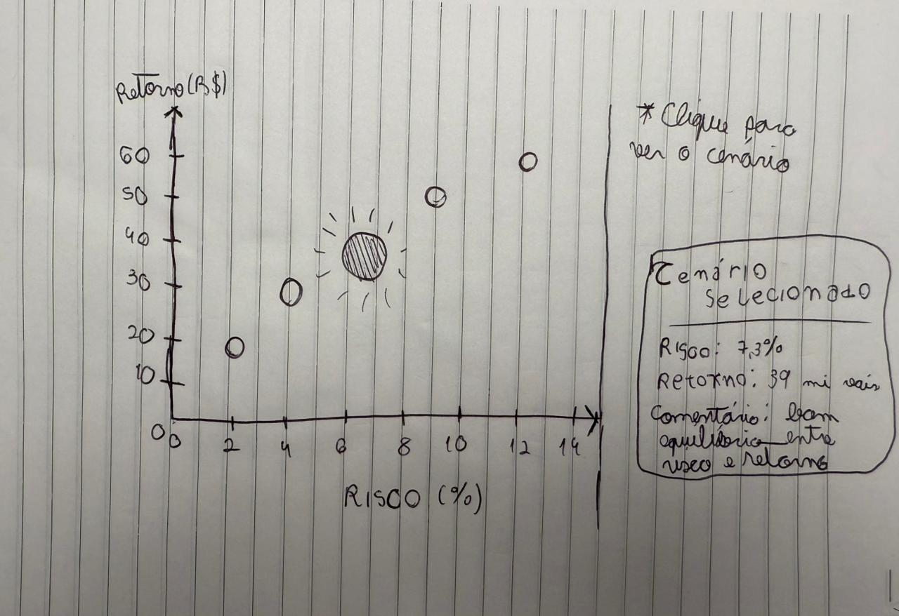

# Microinterface — Curva Risco x Retorno

## 1. Introdução à proposta

Esta microinterface foi desenvolvida como um protótipo visual exploratório relacionado ao projeto de otimização de limites pré-aprovados de crédito. A proposta busca representar, de forma simples e interativa, a comparação entre diferentes cenários de política de crédito a partir de dois indicadores centrais: risco e retorno.

No gráfico, o eixo X representa o risco esperado, associado à inadimplência financeira, enquanto o eixo Y representa o retorno estimado da política simulada. Cada ponto do gráfico simboliza um possível cenário de decisão. A interação ocorre por clique: a cada clique do usuário, um novo cenário é destacado, e suas informações aparecem em um painel lateral.

O objetivo da interface é ajudar o usuário a compreender visualmente o trade-off entre risco e retorno, facilitando a comparação entre alternativas e tornando mais intuitiva a leitura dos resultados de uma simulação de política de crédito.

---

## 2. Rascunhos iniciais

Antes da implementação em p5.js, foi elaborado um rascunho visual da microinterface para organizar os principais elementos da proposta.

A ideia inicial foi manter a interface simples, evitando muitos controles ou telas complexas. Por isso, a microinterface foi estruturada com apenas dois componentes principais:

1. **Gráfico Risco x Retorno**  
   Representa visualmente os cenários simulados, permitindo comparar risco e retorno de forma rápida.

2. **Painel de cenário selecionado**  
   Exibe as principais informações do cenário destacado, como risco, retorno e uma breve interpretação.

A interação escolhida foi propositalmente simples: ao clicar na tela, o destaque muda para o próximo cenário. Essa escolha permite criar uma experiência funcional e compreensível, sem exigir uma implementação complexa.

### Rascunho da interface



---

## 3. Registro do resultado obtido

O resultado final é uma microinterface funcional desenvolvida em p5.js, composta por um gráfico de dispersão e um painel informativo. A aplicação apresenta cinco cenários simulados, cada um com valores de risco e retorno esperados.

Ao clicar na tela, o usuário percorre os cenários disponíveis. O ponto selecionado é destacado visualmente no gráfico, enquanto o painel lateral atualiza automaticamente as informações do cenário correspondente.

Essa interação torna a visualização mais dinâmica e ajuda o usuário a entender que cada cenário representa uma alternativa possível de política de crédito. Dessa forma, a microinterface contribui para tornar os resultados do modelo mais tangíveis, comparáveis e fáceis de interpretar.

### Funcionalidades implementadas

- Visualização de cenários em gráfico Risco x Retorno.
- Destaque visual do cenário selecionado.
- Alteração do cenário destacado por clique.
- Exibição de risco, retorno e comentário interpretativo.
- Interface simples, limpa e coerente com o contexto do projeto.

### Arquivos do projeto

```txt
microinterface/
├── index.html
├── sketch.js
├── README.md
└── assets/
    └── rascunho_microinterface.png